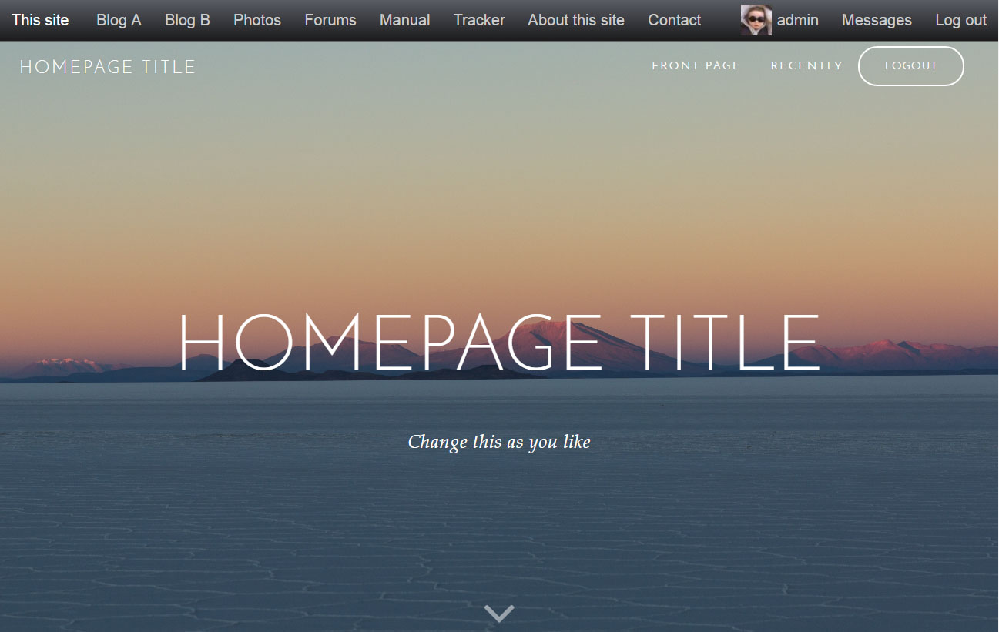

# "Jared" skin for b2evolution CMS.

"Jared" is equipped with a set of predefined CSS classes, that can be used to change content layout througout the skin.

#### Menu links class

<code>menu-button</code> - creates special menu link layout

#### Font size classes

<code>text-xl</code> - increases font size by 60% 
<code>text-lg</code> - increases font size by 30% 
<code>text-sm</code> - decreases font size by 20% 
<code>text-xs</code> - decreases font size by 40% 

#### Special classes implementation

These classes can be simply insert:

1. in widgets - in <code>CSS Class</code> field, for example <a href="http://b2evolution.net/media/blogs/man/skin-guide/widget_edit_screen.png?mtime=1428614162" target="_blank">here</a> or through HTML Widget;
2. in posts, through Markup post view.
